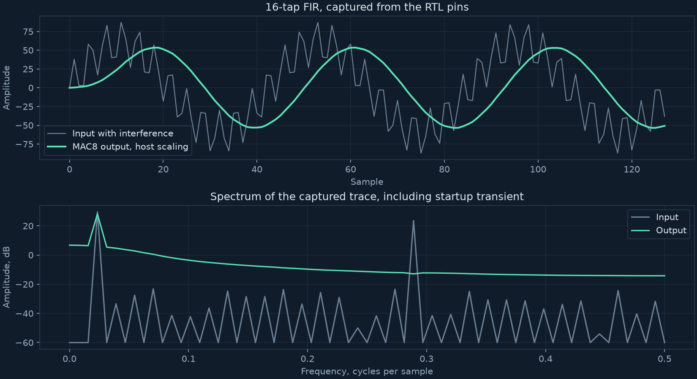
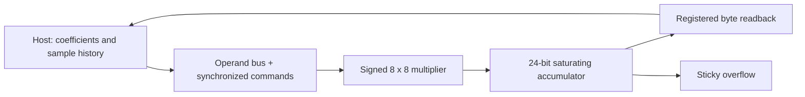

# MAC8

An int8 serial multiply accumulate unit for the Tiny Tapeout TTSKY26c
shuttle, sky130. 8 bit signed times 8 bit signed, accumulated into 24 bit
signed with saturation and a sticky overflow flag. One multiplier, one
accumulator, one command decoder. The atom of AI compute, small enough to
tape out, deep enough to defend line by line.

Built RTL to GDS on open tools, SystemVerilog, cocotb, Icarus, Verilator,
LibreLane through the Tiny Tapeout flow. Results are labeled by simulation, synthesis or physical-design stage.

Implementation was agent assisted. The design decisions, the review
rulings, the verification strategy, and the adversarial audits are owned by
me.

## DSP application and optimization

MAC8 now runs a host-controlled, 16-tap INT8 FIR filter through the actual
pin interface. The driver, independent integer reference, captured samples,
waveform and spectrum are included. A separately versioned fused-load/MAC
candidate reduces execution from **364 to 252 simulated cycles per output**
with **1.48% higher routed standard-cell area** under identical implementation conditions.

| Evidence | Result | Scope |
|---|---:|---|
| Signed multiplication | All 65,536 operand pairs | RTL datapath simulation |
| Application regressions | 9 tests per RTL variant | Pins, exact arithmetic, reset and busy |
| Command soak | 100,000 operations per variant | Deterministic seeds, saturation and recovery |
| FIR trace | 128 outputs, zero integer mismatches | RTL and candidate gate netlist |
| Candidate gate regression | 9 tests, 100,000 scheduled operations | Fresh powered netlist |
| Routed candidate | 1203 cells, +0.702 ns setup, +0.114 ns hold | Nine corners, transition exceptions remain |
| Fused scheduling | BMC, induction and reachable covers pass | Control properties; arithmetic outside proof |
| Fault injection | 3 application mutants and 1 formal mutant caught | Old B, missing MAC, busy and reset |

[Open the portfolio](https://arnav66692.github.io/mac8/reports/dsp-demo/),
[view it locally](reports/dsp-demo/index.html),
[inspect the optimization](docs/OPTIMIZATION.md), or
[run the board demo](docs/BRINGUP.md).
[Submission package and candidate choice](docs/SUBMISSION.md) records what is ready and what needs a portal receipt.





## Implementation and submission status

The baseline has a successful historical SKY130 hardening build and
15 passing Tiny Tapeout prechecks. The archived raw reports below establish
that implementation result. **Portal submission, payment and allocation
are unverified** because this repository does not contain a confirmed
project ID, revision and receipt. Fabrication and physical bring-up are
separate milestones.

The baseline remains at spec v0.5. The fused candidate lives in
`experiments/fused/` with its own module name and opcode contract; its
workflow stages and hardens that version independently. The candidate
passes hardening, 15 prechecks and the gate-level application regression.
It remains experimental because its 282 worst-corner transition violations
require a separate review. Baseline W1 acceptance does not cover the candidate.

## The seal

The historical physical-design numbers here cite one netlist and its sha256.
The waiver, the datasheet, and this README describe that sealed package from
outside it, they are documentation, not new state.

| Seal | Value |
|---|---|
| Final hardened run | CI 29401092054 |
| Commit | 49f5f298692f274c6613cdc940e0cee991281943 |
| Raw reports | [Hash manifest](reports/sealed/29401092054/manifest.json), [successful CI run](https://github.com/Arnav66692/mac8/actions/runs/29401092054) |
| Netlist sha256, the one hash | 5d41493182cd1ece30f2f4a2bdabdf5433400f7b508858161ea6f72db4f13fb0 |

## Historical baseline physical-design results

| Number | Value |
|---|---|
| Standard cells | 1188, one tile, 64 percent utilization |
| Die and core area | 17954.7 and 16493.3 um2, the fixed 1x1 tile |
| Setup, worst corner max_ss_100C_1v60 | plus 1.556 ns at 50 MHz, TNS 0 |
| Hold, worst corner min_ff_n40C_1v95 | plus 0.111 ns, net of 0.25 ns clock uncertainty and 5 percent derate, TNS 0, all nine corners met |
| DRC, LVS, antenna | 0, 0, 0 |
| Tests | 9 datapath plus 14 protocol white box RTL, 14 pin only gate level, all green |
| Formal | handshake proven unbounded, yosys smtbmc with z3, BMC 60, induction closes at step 30, mutation gated, formal/README.md |
| Metastability MTBF bound | Conditional estimate using the extraction assumptions in [CDC_MTBF.md](docs/CDC_MTBF.md); not a measured silicon failure rate |

## The two waived warts

One waiver, W1, two classes of the same max transition finding,
docs/WAIVERS.md.

- Class 1, datapath fanout. Input slew past the 0.75 ns library limit on
  operand and multiplier high fanout nets, worst 1.207 ns at
  max_ss_100C_1v60. It clears on slack. The worst setup path runs through
  these nets and holds plus 1.556 ns. Charge the full extrapolation excess
  along the whole path and it still holds plus 0.46 ns, 1.41x inside.
- Class 2, reset tree. One branch of the synchronized reset fanout, net42,
  0.899 ns at max_ss. It transitions once per reset, not per cycle, and the
  reset release paths are met at every corner.

Max cap is clean at all nine corners. The Tiny Tapeout precheck does not
gate on max transition and read 15 of 15 green.

## Pin map

Interface spec, docs/SPEC.md, frozen, the version lives inside the file.
Clock 50 MHz nominal.

| Pin | Dir | Role |
|---|---|---|
| ui_in[7:0] | in | Operand bus |
| uio[2:0] | in | Command |
| uio[3] | in | Strobe, async, synchronized inside |
| uio[4] | out | Busy |
| uio[5] | out | Overflow flag, sticky |
| uio[7:6] | out | Reserved, driven 0 |
| uo_out[7:0] | out | Selected accumulator byte, registered |

Commands, 000 NOP, 001 CLR, 010 LDA, 011 LDB, 100 MAC, 101 SEL_LO,
110 SEL_MID, 111 SEL_HI. One command per strobe rise. Driver rules and
timing requirements are in the spec, each interface requirement has a
pinning test that runs on the hardened netlist.

## Layout

```
src/     four design modules plus the Tiny Tapeout top and hardening config
tb/      white box RTL suites, golden model, local only
test/    pin only suite, runs at RTL and on the hardened netlist in CI
docs/    SPEC.md the frozen contract, CDC_MTBF.md the metastability bound,
         HOLD_REPORT.md, GL_TIMING.md, FANOUT_FF1.md, WAIVERS.md,
         info.md the shuttle datasheet, cdc/ the extraction bench and sweeps
formal/  the mutation gated handshake proof, README, harness, gate script
```

## Reproduce the application

```sh
python -m unittest app.test_reference -v
make -C verification -f arithmetic.mk
make -C verification VARIANT=baseline
make -C verification VARIANT=fused
python scripts/check_app_mutations.py
python scripts/check_fused_control.py
```

The application suites each include the full 100,000-operation soak.
[Verification matrix](docs/VERIFICATION_MATRIX.md) records the requirements,
seeds, proof assumptions and remaining hardware measurements. Local report
rendering requires numpy, matplotlib, a SKY130 Liberty synthesis run and the
archived reports; see [OPTIMIZATION.md](docs/OPTIMIZATION.md).

## How to test the baseline

Run from the repo root. Install Icarus and Verilator on your PATH before these commands.

```
# one time venv, outside the repo, cocotb 2.0.1 needs Python 3.13 or lower
python3.12 -m venv ~/.venvs/mac8
source ~/.venvs/mac8/bin/activate
pip install -r test/requirements.txt

# white box RTL suites
make -C tb TB=datapath
make -C tb TB=top

# pin only suite at RTL, the same suite CI runs on the netlist
make -C test

# lint
verilator --lint-only -Wall --top-module tt_um_arnav_mac8 \
  src/mac8_*.sv src/tt_um_arnav_mac8.sv
```

CI runs the Tiny Tapeout GDS action, the shuttle precheck, and the gate
level suite on every push.

## How to run the proof

```
brew install yosys z3

# the acceptance test, it builds the proof, base passes and every mutation
# that removes a real protection is caught
bash formal/mutation_test.sh 60
```

The full BMC and unbounded induction recipe, the four properties, and the
mutation table are in formal/README.md.

## The verification story

Adversarial review with mutation testing is the primary gate, and it caught
what the green suites could not. An exact rail saturation gap, a reset
phantom command, an arm bit reading the metastable flop, a lockout width
that ate a legal command at an alignment no deterministic simulation can
produce, and a reset pin the harness never promised to synchronize. Each
fix is pinned by a test where a test can see it, and by a written proof
where one cannot. The handshake proof itself passed vacuously twice before
it was real. Both audits and the mutation gate that closed them are in
formal/README.md.

## Deep docs

- docs/SPEC.md, the frozen interface contract, the version lives inside the file.
- formal/README.md, the mutation gated handshake proof and the two vacuity audits.
- docs/CDC_MTBF.md, the metastability extraction and the MTBF bound.
- docs/HOLD_REPORT.md, per corner hold.
- docs/GL_TIMING.md, the annotated gate level timing.
- docs/FANOUT_FF1.md, the ff1 fanout evidence.
- docs/WAIVERS.md, the one waiver and its two classes.
- docs/info.md, the shuttle datasheet.
