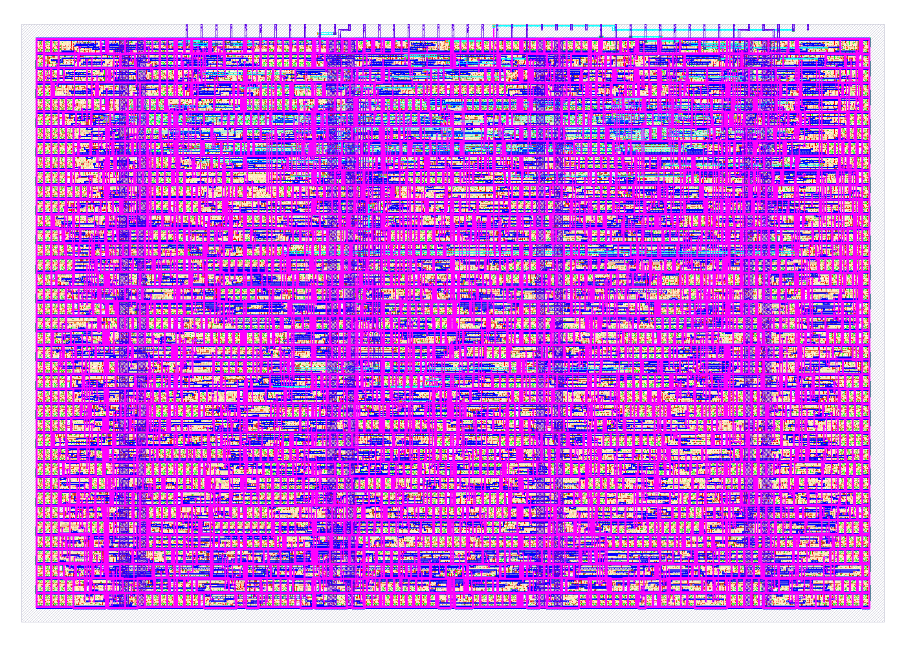

<!---
This file is used to generate your project datasheet. Please fill in the information below and delete any unused
sections.

You can also include images in this folder and reference them in the markdown. Each image must be less than
512 kb in size, and the combined size of all images must be less than 1 MB.
-->

## How it works

MAC8 is a serial signed multiply accumulate unit, one step of a dot product per command. It multiplies two 8 bit signed operands into a 16 bit product and accumulates into a 24 bit signed accumulator, saturating at 8388607 and minus 8388608. Saturation sets a sticky overflow flag that only CLR clears. The accumulator reads out one byte at a time through a select register.

Inside there are four blocks. A synchronizer takes the asynchronous strobe through two flops, detects the rising edge, and fires one accept pulse per external edge, 2 to 3 core clocks after it. An arm bit blocks any accept until the strobe has been observed low after reset. A lockout ignores further accepts for 3 clocks after any accept. The precise guarantee, the lockout suppresses re crossings whose accepts land 1 to 3 clocks after an accepted edge, which covers any ring that fits inside the legal pulse shape, and a legal command at the worst async alignment still lands. A re crossing later than that, below the pulse timing contract, is indistinguishable from a second intended strobe and may execute. Use external debouncing for slow or bouncy edges, an RC or a Schmitt driver at millisecond scales. A reset synchronizer takes the asynchronous rst_n pad through two flops before any module sees it. A decoder turns the accepted command code into exactly one control pulse. The datapath holds all data state and does the arithmetic.

Commands on uio[2:0], executed on strobe rise. 000 NOP. 001 CLR, accumulator and overflow flag to 0. 010 LDA and 011 LDB latch ui_in as signed operands. 100 MAC computes acc plus A times B with saturation. 101, 110, 111 select the low, middle, or high accumulator byte on uo_out.

The design is frozen against its interface spec, kept in the project repository at docs/SPEC.md, the version lives inside the file. The clock is 50 MHz nominal.

## How to test

Reset first, with the clock running. The reset is synchronous, it acts only on rising clock edges, so rst_n does nothing while the clock is stopped and holding it low without a clock resets nothing. Hold rst_n low at least 3 clocks. Hold the strobe low across reset release and for at least 5 clocks after it, the release crosses the 2 flop synchronizer in 2 to 3 clocks depending on where the pad edge lands in the clock cycle, and the arm settles after that. The first command after reset needs the strobe observed low, then a fresh rise. Outputs are undefined until the reset has been sampled and acted on, from power up they can read X or garbage until then.

Drive one command per strobe rise. Set uio[2:0] and ui_in first, then raise the strobe. Hold it high at least 3 clocks and low at least 2 before the next rise. Hold the command and data stable the whole time the strobe is high and for 2 clocks after it falls. Commands arriving while busy is high are ignored, dropped not deferred, so respect the spacing rules and busy never bites.

Dot product of length N. CLR once. Per element, LDA x_i, then LDB w_i, then MAC. After the last element, SEL_LO, SEL_MID, SEL_HI, reading uo_out after each. Sample uo_out no earlier than 4 clocks after the SEL strobe rise. Reconstruct the 24 bit result from the three bytes and check the overflow flag on uio[5].

A quick smoke test. CLR, LDA 6, LDB 7, MAC, SEL_LO. uo_out reads 42.

## External hardware

None required. Driving the chip directly takes 24 signals, the 22 data pins, 8 outputs to ui_in, 4 outputs to uio[3:0], 2 inputs from uio[5:4], and 8 inputs from uo_out, plus clk and rst_n. On the Tiny Tapeout devkit the demo board supplies clk and rst_n, so a microcontroller needs 22 free GPIO pins. At GPIO toggle speeds the strobe timing rules are met with huge margin.

## Layout

The hardened macro on one Tiny Tapeout tile, sky130. The full die shows the standard cell rows packed across the tile under the routing metals, with the pin labels along the top edge. The zoom is a 30 by 20 micron interior window where individual rows and cells are visible.

Both images are rendered by scripts/render_datasheet_images.py from the sealed GDS of CI run 29401092054 at commit 49f5f29, GDS sha256 5f1bae23645628acda6ac34e048324c5ed57117523c580e1ca41f20c616e8884, with the sky130A layer colors from the PDK's KLayout properties file. The full artifact hash set is in docs/PROVENANCE.md.

## Pin map

| Pin | Dir | Role |
|---|---|---|
| ui_in[7:0] | in | Operand bus |
| uio[2:0] | in | Command |
| uio[3] | in | Strobe, async, synchronized inside |
| uio[4] | out | Busy |
| uio[5] | out | Overflow flag, sticky |
| uio[7:6] | out | Reserved, driven 0 |
| uo_out[7:0] | out | Selected accumulator byte, registered |

## Reset path and polarity

rst_n is active low the whole way, with no inversion at any step. F2 was a reset bug, so the mapping is shown, not assumed.

| Step | Signal | Polarity | Notes |
|---|---|---|---|
| Tiny Tapeout harness | rst_n | active low, 0 resets | harness convention, handled like any other input pin, asynchronous |
| Wrapper tt_um_arnav_mac8 | rst_n | active low | into u_rst_sync only, no module sees the raw pad |
| u_rst_sync | rst_n_pad to rst_n_sync | active low | two plain flops, no reset on themselves, 2 clock crossing |
| u_sync | rst_n | active low | always_ff, if (!rst_n) clears ff1 ff2 ff3 seen_reset armed lock_cnt locked |
| u_ctrl | rst_n | active low | always_ff, if (!rst_n) clears busy |
| u_dp | rst_n | active low | always_ff, if (!rst_n) clears a_q b_q acc_q out_sel_q out_byte ovf |

The reset is inside every clocked block, so it is synchronous, it acts on a rising clock edge only, and it needs the clock running. With the clock stopped rst_n has no effect and no state clears. The pad rst_n is asynchronous, the Tiny Tapeout clock spec handles clk and rst_n like any other input pins, so the design synchronizes it through two flops before use, review round two. Assertion and release reach the core 2 to 3 clocks after the pad edge, the pad edge lands anywhere in a clock cycle so the first sampling edge adds 0 to 1 clocks before the 2 flop crossing. Outputs are undefined until the synchronized reset has been sampled and acted on at those edges. In the netlist the synchronous reset appears as an AND gate on each flop's D input, not a dedicated async reset pin, which is why the flops map to dfxtp, a plain flop, not a resettable dfrtp.
